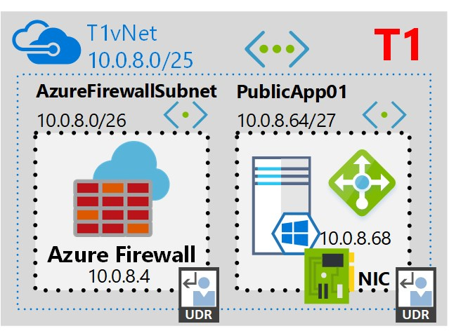
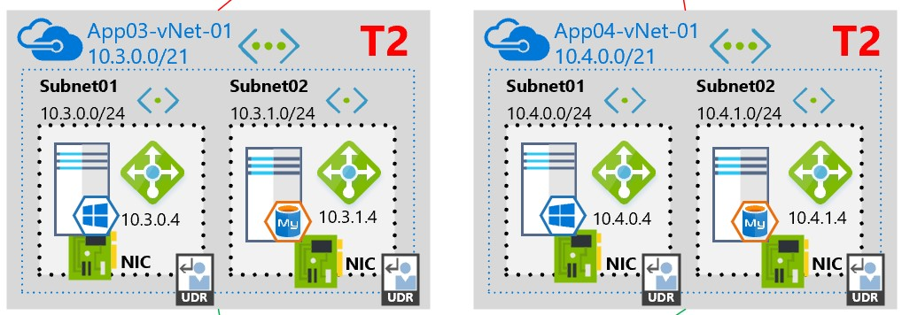
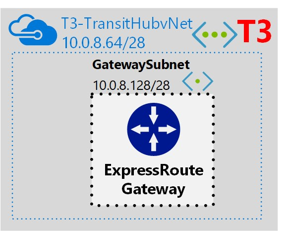
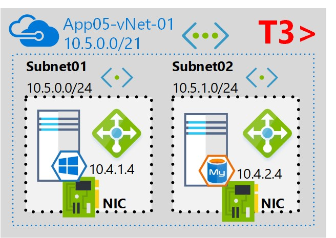
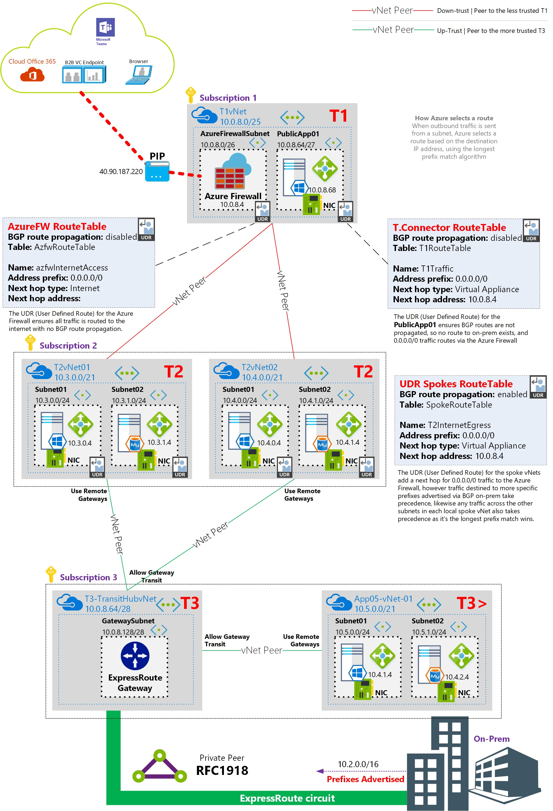

# Part 5 - vNet Peerings
## The Azure 3 Tier Network
This **part 5** of a 5 part series of templates to deploy a glorified 3 tier Azure network
1. https://github.com/marckean/Azure-T1-Network
    - Resource Group based template

  

2. https://github.com/marckean/Azure-T2-Network
    - Resource Group based template

  

3. https://github.com/marckean/Azure-T3-Network
    - Resource Group based template

  

4. https://github.com/marckean/Azure-T3plus-Network
    - Resource Group based template

  

5. https://github.com/marckean/vNetPeerings
    - Subscription based template

 See the **deployment note** below. 

| Template Description |
|---------|
|**Resource Group** deployments deploy to resource groups and use schema: `https://schema.management.azure.com/schemas/2015-01-01/deploymentTemplate.json#`  **Subscription** deployments deploy to subscriptions and use schema: `https://schema.management.azure.com/schemas/2018-05-01/subscriptionDeploymentTemplate.json#`|

For the serious security concious, this 3 tier network topology is one way to achieve super tight network security within Azure. In brief:
- the T1 vNet can't talk directly with the T3 Transit Hub vNet 
- the T3 Transit Hub vNet can't talk directly with the T1 vNet

This 5 part deployment deploys the below Azure based **network components only** including the ExpressRoute gateway, but not the non-network components shown e.g. VMs, NICs, Load Balancers or ExpressRoute circuit itself - these are here to show what it could ultimately look like or be used for after the fact. 

  

## Deployment note
While you can deploy this fully functional deployment customised to suit your needs exactly, you can also deploy this environment **as is** to have a play and have a look at what it looks like in Azure. As part of this fully functional deployment - to ensure everything remains in-tact and works - it's recommended that the first four templates are deployed in the same order as above, however it's mandatory that the last one **vNetPeerings** is deployed last, as it is required that all vNets are deployed in order for peers to be created successfully.

This 5 part series of templates is fully functional with no over-lapping address ranges, UDRs have all the correct next hop IP addresses and all the template parameters are correctly set. In order to deploy this successfully, be sure to deploy the templates to following resource groups:
- Azure-T1-Network | Resource Group **T1_01**
- Azure-T2-Network | Resource Group **T2_01**
- Azure-T3-Network | Resource Group **T3_01**
- Azure-T3plus-Network | Resource Group **T3plus_01**
- vNetPeerings | Resource Group ***Any Resource Group***

This **vNet Peerings** repo is to be deployed last and fills in all the relevant peers for the vNets.

## Custom Deployment
If you want to deploy a customised version of this deployment in a separate environment e.g. production, you can safely modify these templates to suit your own environment and it's super easy, all you need to do is edit the parameters for each template at the time of deployment. 

For this **vNet Peerings** repo, be sure to edit the **peerArray** parameter

  

